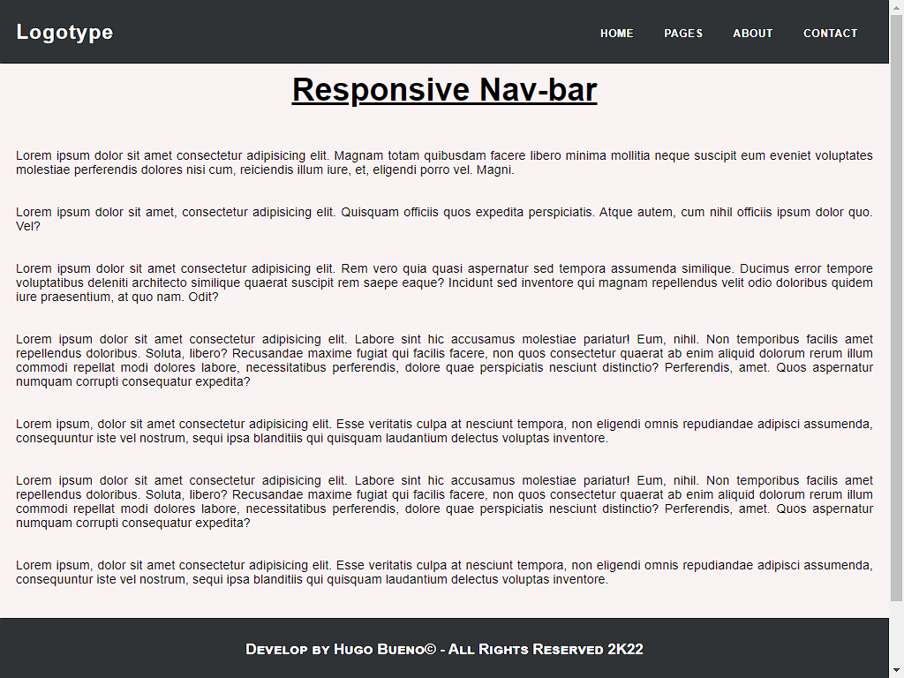

<!--este es un comentario en Markdown, idéntico a uno de Html-->
# **HB**  :boom: :dog:

## **Barra de navegación** 

 

* [ ] No responsive
* [x] Respoinsive

* Es una **barra de navegacion** sencilla que incluye Html-Css-Javascript.

 

>Proyecto de prueba con git/github, incluyendo Markdown.

 

 

## Si queres saber acerca de Markdown dale clic a la siguiente imagen..

